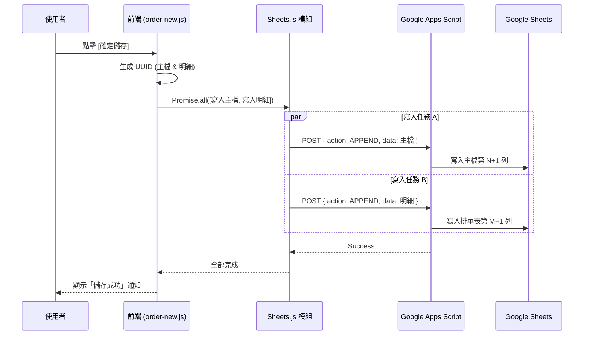

# 00. 小灶私廚 — 系統正式規格書 (System Formal Specification)

**文件狀態**：正式版 (v2.0)
**對應架構**：Google Apps Script (GAS) Serverless 架構

---

## 1. 系統概述 (System Overview)

本系統為「小灶私廚」量身打造，旨在透過極輕量的網頁介面，取代傳統的手動試算表記錄。系統核心導入了 **GAS API 中介層**與 **UUID 唯一識別機制**，確保在雙人協作、手機/電腦跨裝置操作時，資料的精準度與同步效率達到最佳化。

### 1.1 技術選型
- **前端**：Vanilla JavaScript (ES6+), CSS3 (自定義 RWD), HTML5。
- **後端**：Google Apps Script (GAS) 作為 API 閘道。
- **資料庫**：Google Sheets (試算表) 作為持久化存儲，並以 UUID 作為資料主鍵。

---

## 2. 功能模組與函數清單 (Modules & Functions)

### 2.1 核心控制器 (`app.js`)
負責系統路由、狀態切換與全域快取管理。
- `init()`: 初始化全域導覽按鈕監聽。
- `onLogin()`: (保留接口) 處理登入後的資料預載。
- `navigateTo(pageId)`: 切換前端分頁顯示邏輯。
- `getMenu()`: 取得菜單快取，若無則向 API 請求，減少重複讀取。
- `clearMenuCache()`: 清除本地菜單快取（當菜單異動時觸發）。

### 2.2 資料通訊模組 (`sheets.js`)
封裝與 GAS 端點的所有 HTTP 通訊。
- `requestGAS(payload)`: 底層發送 POST 請求至 GAS 的核心函數。
- `getSheet(sheetName)`: 獲取特定分頁之全量數據。
- `appendRows(sheetName, values)`: 新增多筆資料列。
- `updateById(id, rowValues)`: 透過 UUID 定位並更新單筆資料。
- `batchUpdateById(updates)`: 批量 UUID 更新，提升大量儲存時的效能。
- `batchDeleteById(ids)`: 批量 UUID 刪除。

### 2.3 新增訂單模組 (`order-new.js`)
- `addItem()`: 動態在畫面新增一列菜單選擇列。
- `onItemChange(id)`: 選擇品項後自動帶入菜單定義的預設量與價格。
- `updateSubtotal(id)`: 即時計算單品小計。
- `save()`: **核心函數**。同時生成主檔 UUID 與明細 UUID，並發送 `Promise.all` 並發儲存。

### 2.4 排單管理模組 (`order-list.js`)
- `query()`: 依據日期與狀態篩選器擷取訂單。
- `showDetail(idx)`: 開啟彈窗顯示該訂單的完整明細。
- `saveChanges()`: 批量更新畫面勾選訂單的「排程狀態」或「收款日期」。
- `saveDetail()`: 儲存明細異動，包含主檔金額自動連動更新邏輯。

### 2.5 營收統計模組 (`revenue.js`)
- `query()`: 核心統計邏輯，整合訂單、明細與菜單成本。
- `getVal(obj, keys)`: **容錯函數**。自動處理試算表欄位名稱的前後隱形空白字元。
- `renderResult()`: 將統計後的總營收、已收款、預估毛利呈現於卡片與表格。

---

## 3. 前後端交互時序 (Storage Interaction)

以下展示「儲存訂單」時的並發執行邏輯，這保證了系統的極速體驗：

---

## 4. 系統限制 (Constraints)
1. **API 配額**：受限於 Google 免費版限制，每日 URL 請求次數雖高，但在極端頻繁操作下可能觸發頻率限制。
2. **快取延遲**：更改菜單後需點擊「重新查詢」或清空快取，前端才會抓到最新價格。
3. **瀏覽器暫存**：修改 CSS/JS 代碼後，必須進行強制刷新 (`Ctrl+F5`) 以載入最新版本檔案（見 index.html 帶版本號之標籤）。
